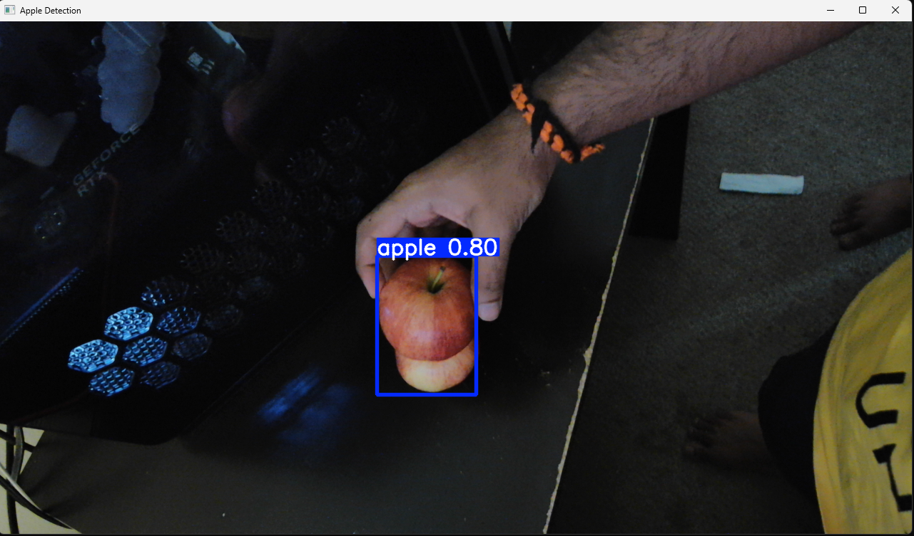
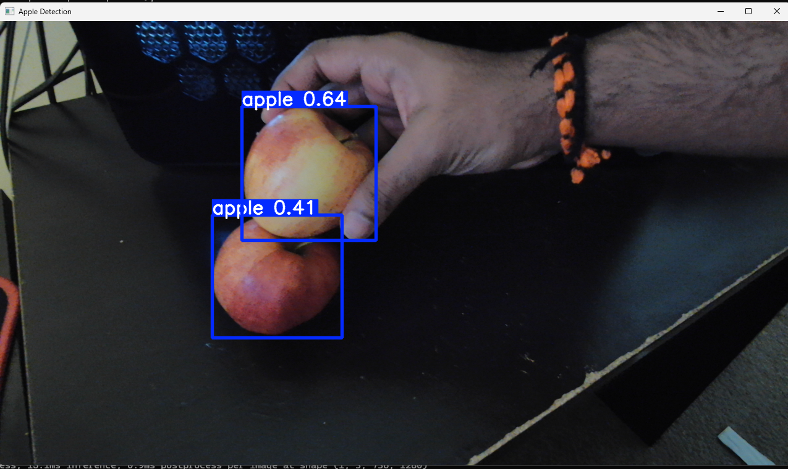
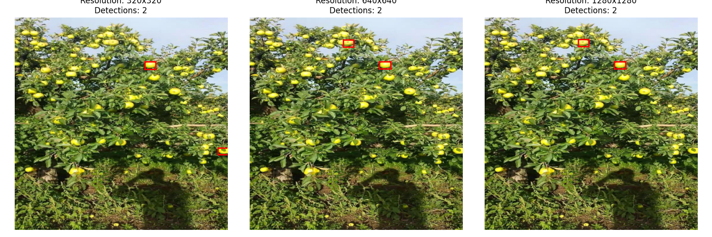

# Occlusion-Aware Apple Detection Using Custom YOLO Architecture
## Authors
Ashruj Gautam\n
Pratheek Tirunagari
## Overview

This project focuses on building a robust object detection model for self-checkout systems, specifically targeting apple detection. While standard models like SSD and Faster R-CNN struggled with occlusion and small object detection, we designed a custom YOLO-based architecture to address these issues directly.

The model was trained on the COCO dataset (class 47 – apples) and the MinneApple dataset. Through architectural improvements, occlusion-aware loss functions, and resolution-sensitive analysis, this project improves YOLO’s reliability in detecting partially hidden and distant apples.

---

## Motivation: Occlusion as a Real-World Challenge

In practical applications such as retail checkout and orchard monitoring, apples are often:

- Partially hidden behind other objects or foliage
- Distant from the camera and thus appear small in the image

Traditional object detection architectures fail under such conditions due to limited context capture, weak feature fusion, or resolution sensitivity. This project identifies these shortcomings in YOLO and proposes a complete solution pipeline.

---

## Key Contributions

### 1. Custom YOLO Architecture

- **Larger Receptive Field**: Modified SPPF kernel size from 5×5 to 7×7 for improved contextual awareness of occluded apples.
- **Cross-Stage Partial Spatial Attention (C2PSA)**: Used 3-repeat C2PSA blocks for stronger feature fusion across layers.
- **Multi-Scale Feature Pyramid (P3/8, P4/16, P5/32)**: Enables detection of apples at varying distances and sizes.

### 2. Occlusion-Aware Loss Function

- **CIoU Loss**: Enhances bounding box precision using overlap area, center distance, and aspect ratio.
- **Focal Loss (Modified for Occlusion)**: Penalizes the model more when misclassifying partially hidden apples.
- **Distribution Focal Loss (DFL)**: Optimizes coordinate prediction for improved localization.

### 3. Resolution-Sensitive Detection

Using the MinneApple dataset, we performed resolution analysis and determined optimal image input sizes for apple detection at different distances:

- 320×320 for medium-range apples
- 416×416 for distant apples

### 4. Enhanced Post-Processing

- **Soft-NMS**: Retains multiple overlapping detections with reduced confidence rather than discarding them.
- **Multi-Scale Inference**: Evaluates images across multiple scales for more robust detection.
- **Sliding Window**: Ensures coverage in high-resolution images by dividing and scanning overlapping regions.

---

## Experimental Results

| Model             | mAP@50 | Occlusion Handling | Real-Time Inference |
|------------------|--------|--------------------|----------------------|
| SSD              | Low    | Poor               | Yes                  |
| Faster R-CNN     | Moderate | Moderate         | No                   |
| **Custom YOLO**  | 0.392  | Strong             | Yes                  |

Metrics shown for validation performance. See `results.csv` for epoch-wise performance data.

---

## Datasets

### COCO Dataset
- Used only **class 47 (apple)** images.
- Preprocessing: Normalization, resizing to 1280×1280.
- Augmentation: Mosaic, flipping, HSV color space shifts.
- Source: [https://cocodataset.org/#home](https://cocodataset.org/#home)

### MinneApple Dataset
- Specializes in orchard apple imagery.
- Contains small, distant apple instances.
- Used for **resolution benchmarking** and distance-aware inference design.
- Source: [https://rsn.umn.edu/projects/orchard-monitoring/minneapple](https://rsn.umn.edu/projects/orchard-monitoring/minneapple)  

---

---

## Implementation Details

- Framework: PyTorch
- Optimizer: AdamW (cosine decay, warmup scheduling)
- Batch Size: 4
- Loss Scaling: Adaptive gradient-based scaling
- Training: Conducted on GPU with limited resources; total training epochs ~130

---

## Visualizations

**Occlusion Case Example**  

**Post-Processing Result**  

**Resolution Sensitivity Test**  

## Full Report

The complete documentation, methodology, architecture diagrams, loss functions, resolution results, and evaluation metrics are available in the [project report (PDF)](https://github.com/Pratheek-Tirunagari-and-Ashruj-Gautam/DeepLearning_Project/blob/main/report.pdf).

---

## Future Work

- Integration with Android-based self-checkout app
- Real-time benchmarking on embedded devices (e.g., Jetson Nano, Raspberry Pi with Coral)
- Fine-tuning with hard example mining

